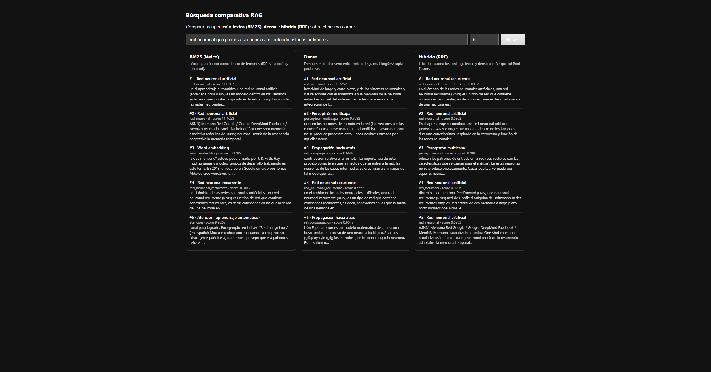

# Evidencia de despliegue

Servicio de búsqueda comparativa (FastAPI) del Proyecto 5. Capturas de los
endpoints tomadas contra el contenedor `api` en `http://localhost:8000`.

## Cómo reproducir

```bash
docker compose up api           # construye el índice y sirve en el puerto 8000
# Interfaz web: http://localhost:8000/
```

## Archivos de esta carpeta

| Archivo | Endpoint | Contenido |
|---|---|---|
| `health.json` | `GET /health` | Comprueba que el servicio está activo. |
| `metrics.json` | `GET /metrics` | Corpus (595 fragmentos / 40 artículos), métodos, modelo y manifiesto del índice denso. |
| `search_hybrid.json` | `POST /search` | Top-3 del método híbrido para una consulta semántica. |
| `compare_q20.json` | `GET /compare` | Top-3 de **los tres métodos lado a lado** para la misma consulta. |
| `home.html` | `GET /` | Página del buscador comparativo (HTML servido por la API). |



## Endpoints

- `GET /` — buscador HTML: caja de búsqueda + `k`, muestra BM25 / denso / híbrido en columnas.
- `POST /search` — cuerpo `{"query", "method": "bm25|dense|hybrid", "k"}` → top-k con `doc_id`, `source_id`, `title`, `score`, `rank` y fragmento.
- `GET /compare?q=...&k=...` — top-k de los tres métodos para la misma consulta.
- `GET /health` — estado del servicio.
- `GET /metrics` — tamaño del corpus, métodos, modelo denso y manifiesto del índice.

Cada resultado incluye el `score` del método y una `explicacion` de cómo puntúa,
de modo que el ranking es interpretable (requisito del despliegue mínimo).
